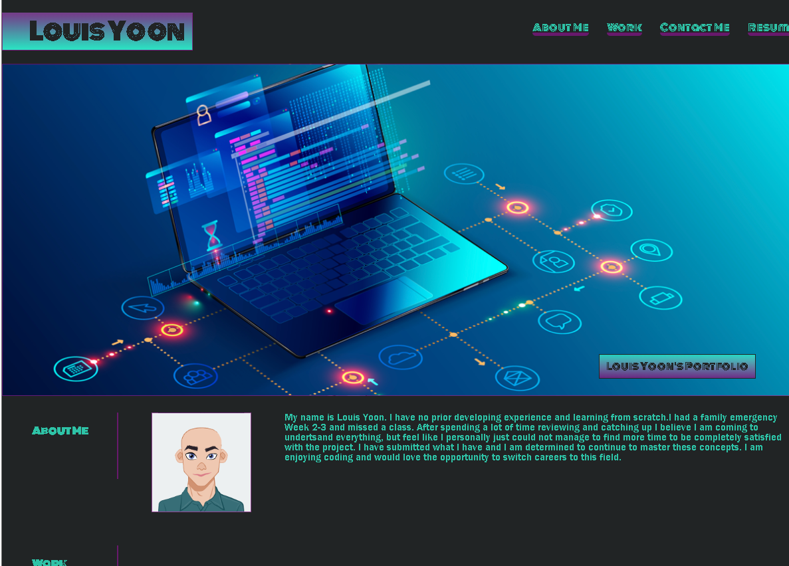
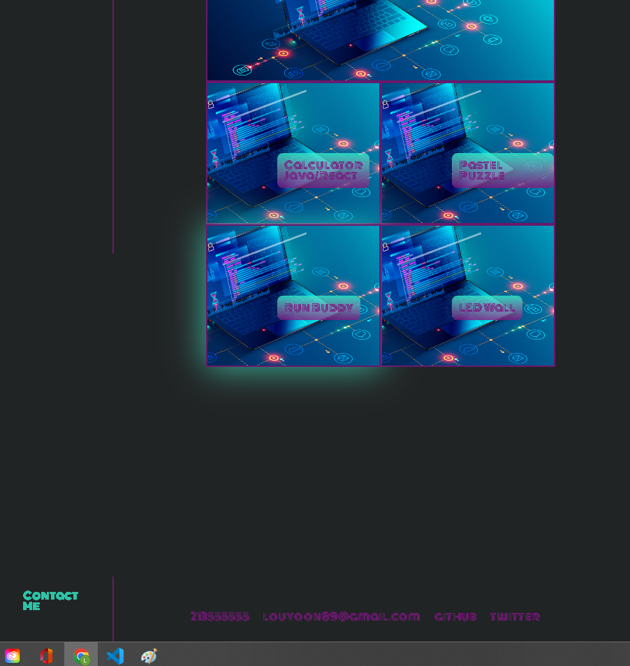

# Week-2-Challenge-Portfolio
Week 2 Challenge - Portfolio Project

## Portfolio Challenge
* In our classes' first "even week" challenge we prepared ourselves to create our first web application with the knowledge we obtained this week. We will start creating a portfolio that will showcase our skills and qualifications.

### Challenge Goals
* We will culminate our knowledge of this week's lessons of HTML and CSS to create a webpage from scratch.
* Practicing ournew skills we will create a portfolio that will start a blueprint/foundation for a portfolio we can utilize in our future job searb.
* We will demonstrate the our knowledge of previous HTML standards from our first week's challenge.
    * Proper HTML display/structure
    * Proper links/UI scrolls/navigation
    * Use of images
* We will demonstrate our new knowledge of CSS from week 2's lessons:
    * CSS Variables
    * Flexboxes/Positioning
    * Media Quarries 
* Once code base is complete we will have to deploy the application to a live URL and Github URL with new repository that satisfies repository criterias.

## Screenshot

## Status
*  I am setting up page so the top navigation will direct go to proper area. Links for contacts and works are provided with "progress" picture or a link which will be more specific in the future. Flexboxes made and media quarries applied but I will need to practice this more to understand it fully. I had a family emergency Week 2-3 and missed a class. After spending a lot of time reviewing and catching up I believe I am coming to undertsand everything, but feel like I could not manage to satisfy all  criterias. With the time that I dedicated I have submitted what I have. I am determined to continue to master these concepts.
### Live Link
* https://louyoon89.github.io/Week-2-Challenge-Portfolio/
### Github Link
* https://github.com/louyoon89/Week-2-Challenge-Portfolio
